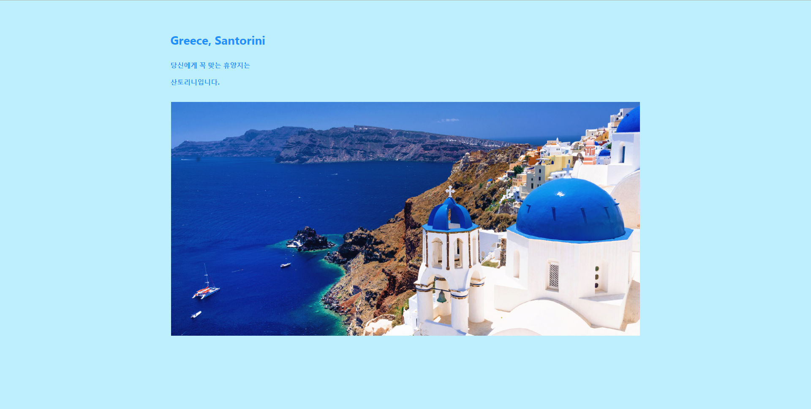
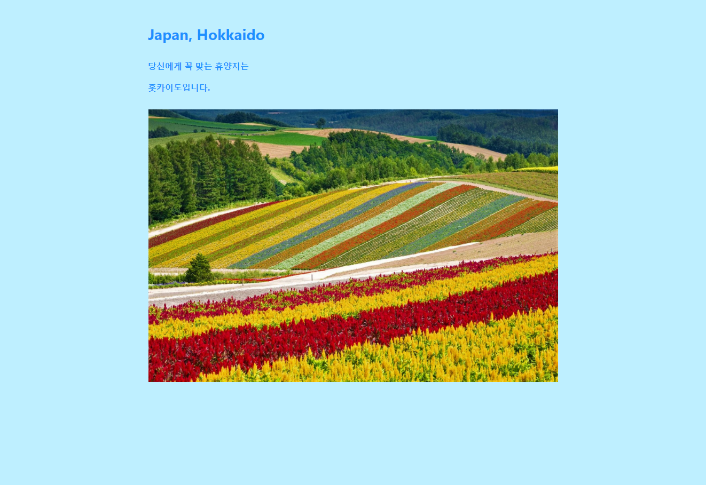

# 3주차 과제: 랜덤게임 만들기

### 구현의도

 3주차 수업에 배웠던 내용을 바탕으로 하여 '직접' 랜덤게임을 만들어본다. 최근 날씨가 매우 쌀쌀하지만, 곧 있으면
굉장히 더워질 것을 생각하여 미리 여름 휴양지를 무작위로 선별해주는 게임을 만들었다.

### 오류 내용 / 해결 방법

 Run Project를 할 때, 에러가 많이 발생하였다. 분명 내가 무언가를 잘못하며 발생한 것일텐데 그것을 찾기가 매우 힘들었다.
꽤나 많은 시간을 들여 찬찬히 살펴보면 괄호를 잘못 닫거나(안 닫거나), 따옴표를 제대로 닫지 않은 것이 원인이었다.
 
이미지 안에 텍스트를 삽입하고 싶었는데, 쉽지 않았다. 내가 원하는대로 글자가 들어가지 않았다. 구글링과 주변 동료의
도움을 통해 index 페이지를 내가 구상한 것처럼 만들어냈다. 
 
 
 .container {
        position : relative;
        margin-top : 5%;
    }
 
 .text-block{
        position : absolute;
        bottom : 50px;
        color: white;
        padding: 18.5% 33.5%;
    }

 1. 먼저 container 박스를 만들고 그 안에 이미지 태그를 이용하여 원하는 이미지를 삽입했다.
 2. 그러고 나서 text-block 이라는 박스를 상기한 이미지 태그처럼 container 박스 안에 넣었다. (이미지 태그 밑)
 3. 위와 같은 진행 후에 text-block에 bottom 값을 주었더니 이미지 속으로 텍스트가 들어갔다.
 4. 텍스트의 가운데 정렬은 padding 값을 수동적으로 조절하여 이뤄냈는데, 미세한 숫자를 바꿔가며 확인하는 과정은 다소 지루했다.
    (더 좋은 방법이 있을 것이니 찾아내고 싶다.)
 

### 간단한 소감

 로또라는 산을 넘자마자 랜덤게임이라는 과제와 또 맞닥뜨렸다. 첫째로 '무슨 게임을 만들어볼까'를 고민하며 많은 시간이 지났고,
둘째는 '이걸 어떻게 만들 수 있을까'를 고민하며 또 많은 시간이 지났다. 최종적으로 index와 places, 2개의 html 파일을 생성했는데, 
과제를 수행하면서 그 사이에 html 파일을 하나 더 만들고자 했었다.  
 바로 결과를 본다는 게 너무 심심했기 때문이다. selects 라는 html 파일을 만들어, 4가지 정도의 성격 유형을 a요소를 통해 주고
그 성격에 맞는 휴양지만 rand 값을 돌려서 하면 더 재밌을 것 같았다. 그런데 고민을 하다보니 그다지 혁신적인 부분이 없었다. 그저
places 파일이 4개로 늘어나는 것 뿐이었다. 그래서 그렇게 하지 않기로 했다. '그래도' 라는 생각보다는 '굳이' 라는 기분이 더 앞섰던 것 같다.  
 html과 css를 이번에 다시 만났을 때, 자기소개 페이지와 팀 프로젝트로 진행한 랜딩페이지 제작을 경험으로 낯설기보단 반가웠다. 하지만 그것은
큰 착각이었다. 나 혼자 그렇게 생각했던 것이지, 그들은 아직도 어려운 친구들이었다. 친하게 지내고 싶은데 그러기 어려운 애들인 것으로 보인다.
평소에도 친밀함을 유지해야만 나중에 또 보게될 때 어색하지 않을 것이다. 그러므로 꾸준히 하는 것이 중요하다.  
 마지막으로 김범식군(경제학과, 26세)의 도움으로 첫 페이지를 멋지게 만들 수 있었다. 물론 혼자 해내는 것도 멋질 것이다. 하지만 도움을 주고 받고, 
토의를 하는 과정에서 얻은 문제 해결은 더욱 멋지다. 그의 도움은 오직 랜던게임을 만드는 과제에만 국한된 것이 아니라, 여러모로 유익한 것이었다. 
이 자리를 빌어 다시 감사를 표한다.

### 참고문서

 3주차 수업자료.pdf
 
 
### 완성본 스크린샷

 

 

